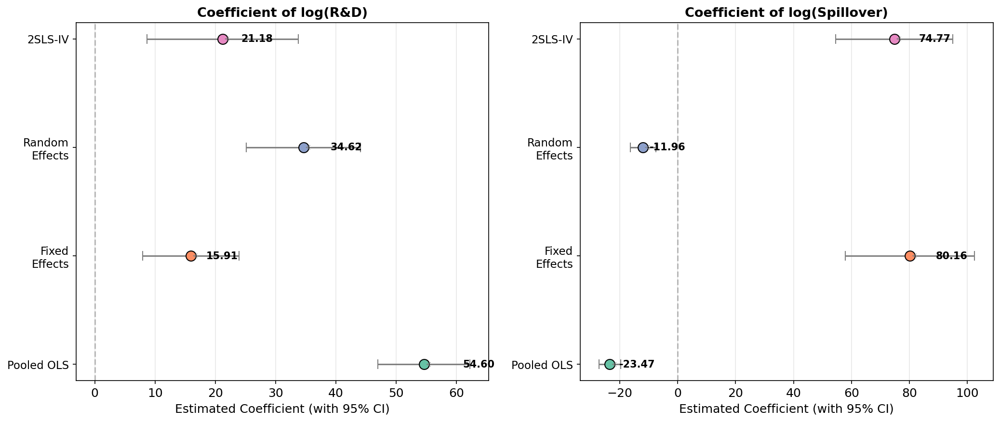
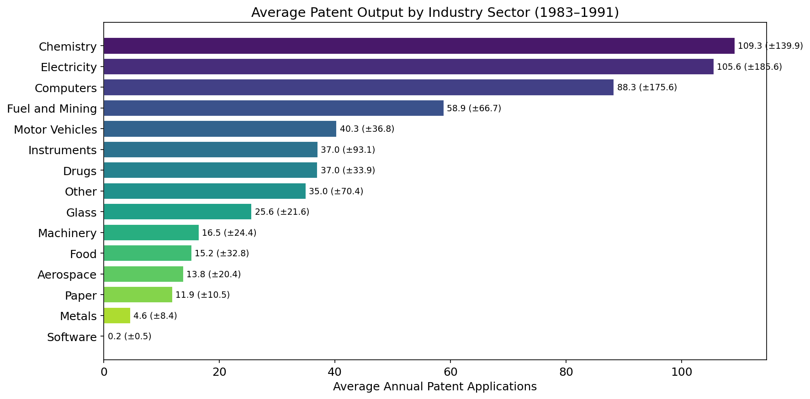
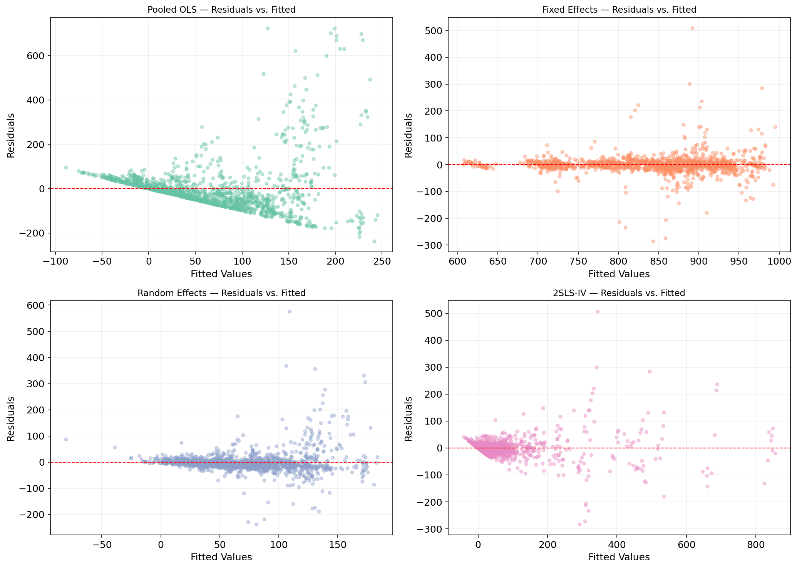

# Firm-Level Innovation & Spillover Effects: An Econometric Analysis

[](notebooks/innovation_panel_analysis.ipynb)
[](https://www.python.org/)
[](LICENSE)
[]()

> **Analyzing how R&D investment and technological spillovers drive firm-level patenting behavior using panel data econometrics.**

---

## 📖 Overview

This project investigates the relationship between **R&D investment**, **technological spillovers**, and **innovation output** (measured by patent applications) at the firm level. Using a panel dataset of **181 international manufacturing firms** across **15 industry sectors** and **4 geographic regions** from **1983 to 1991**, I estimate and compare four econometric models:

| Model | Purpose | Key Finding |
|-------|---------|-------------|
| **Pooled OLS** | Baseline | Overestimates R&D effect (55.52) — ignores firm heterogeneity |
| **Fixed Effects (Within)** | Controls for time-invariant unobserved heterogeneity | R&D coefficient drops to 16.32; spillovers become significant |
| **Random Effects** | More efficient if assumptions hold | Hausman test rejects RE in favor of FE (p < .001) |
| **2SLS-IV** | Addresses endogeneity of R&D | Confirms spillover effect (74.77) as largest among models |

**Core Result:** Both internal R&D and external knowledge spillovers are significant drivers of firm innovation — but correctly estimating their magnitudes requires addressing **both** unobserved heterogeneity and endogeneity.

---

## 🗂️ Project Structure

```
STAT5210_Project/
├── 📁 data/                    # Raw panel dataset & documentation
│   ├── data.mc                 #   Original ASCII data (181 firms × 9 years)
│   ├── readme.mc.txt           #   Data description & variable definitions
│   └── citation.txt            #   Data source citation
├── 📁 notebooks/               # Main analysis
│   └── innovation_panel_analysis.ipynb   # 📓 Complete analysis notebook
├── 📁 src/                    # Python modules
│   └── load_data.py            #   Data loading & preprocessing
├── 📁 figures/                 # Generated visualizations
│   ├── distributions.png
│   ├── patents_by_sector.png
│   ├── patents_by_region.png
│   ├── time_trends.png
│   ├── correlation_matrix.png
│   ├── pairwise_relationships.png
│   ├── coefficient_comparison.png
│   ├── model_fit_comparison.png
│   ├── residual_diagnostics.png
│   └── qq_plots.png
├── requirements.txt           # Python dependencies
├── .gitignore
└── README.md
```

---

## 🔬 Methodology

### Econometric Framework

#### 1. Pooled OLS

$$Y_{it} = \beta_0 + \beta_1 \log RD_{it} + \beta_2 \log Spillover_{it} + \varepsilon_{it}$$

Baseline model ignoring panel structure entirely.

#### 2. Fixed Effects (Within)

Let $\ddot{Z}_{it} = Z_{it} - \bar{Z}_i$ denote the **within-transformed** (demeaned) value of variable $Z$. Then:

$$\ddot{Y}_{it} = \beta_1 \ddot{X}_{1,it} + \beta_2 \ddot{X}_{2,it} + \ddot{u}_{it}$$

where $X_{1,it} = \log RD_{it}$ and $X_{2,it} = \log Spillover_{it}$.  

Removes **time-invariant unobserved heterogeneity** (firm culture, management quality, baseline tech capability) through within-transformation.

#### 3. Random Effects

$$Y_{it} = \beta_0 + \beta_1 \log RD_{it} + \beta_2 \log Spillover_{it} + c_i + u_{it}$$

Assumes individual effects $c_i$ are uncorrelated with regressors — tested via **Hausman test**.

#### 4. Two-Stage Least Squares (2SLS-IV)

Uses **lagged** values of R&D and spillovers as instruments to address **endogeneity** of R&D investment (simultaneity between patenting and R&D spending).

Let $X_{it} = \log RD_{it}$ and $S_{it} = \log Spillover_{it}$. Lagged values $X_{i,t-1}$ and $S_{i,t-1}$ serve as instruments.

**First stage** (predict endogenous $X_{it}$):
$$\widehat{X}_{it} = \gamma_0 + \gamma_1 X_{i,t-1} + \gamma_2 S_{i,t-1} + \gamma_3 S_{it} + c_i + \epsilon_{it}$$

**Second stage** (structural equation with predicted R&D):
$$Y_{it} = \beta_0 + \beta_1 \widehat{X}_{it} + \beta_2 S_{it} + c_i + u_{it}$$

### Hypothesis Tests

| Test | Statistic | p-value | Conclusion |
|------|-----------|---------|------------|
| Hausman (FE vs RE) | $\chi^2 = 44.77$ | < .001 | **Reject RE** — FE is consistent |
| Hausman (FE vs IV) | $\chi^2 = 6.97$ | .031 | **Reject FE** — IV is necessary |

---

## 📊 Key Results

### Model Comparison

|                        | Pooled OLS | Fixed Effects | Random Effects | 2SLS-IV |
|------------------------|:----------:|:-------------:|:--------------:|:-------:|
| **log(R&D)**           | 55.52***   | 16.32***      | 31.33***       | 21.18*** |
| **log(Spillover)**     | -4.29      | 65.04***      | 27.71***       | 74.77*** |
| **N**                  | 1,448      | 1,629         | 1,629          | 1,448   |
| **R²**                 | 0.303      | 0.086         | 0.098          | 0.082   |

*Note: \*\*\*p < 0.01. Standard errors are robust (White/Huber).*

### Coefficient Comparison



### Visualizations

| EDA | Diagnostics |
|:---:|:---:|
|  |  |
| *Average patent output varies significantly by industry* | *Model diagnostics show better fit for FE and IV models* |

---

## 🚀 Getting Started

### Prerequisites
```bash
pip install -r requirements.txt
```

### Run the Notebook
```bash
cd notebooks
jupyter notebook innovation_panel_analysis.ipynb
```

Or execute directly:
```bash
jupyter nbconvert --to notebook --execute innovation_panel_analysis.ipynb
```

### Dependencies
- `pandas`, `numpy` — data manipulation
- `statsmodels`, `linearmodels` — econometric modeling
- `matplotlib`, `seaborn` — visualization
- `scipy` — statistical tests

---

## 📚 References

**Main Reference:**
Cincera, M. (1997). Patents, R&D, and Technological Spillovers at the Firm Level: Some Evidence from Econometric Count Models for Panel Data. *Journal of Applied Econometrics*, 12(3), 265–280.

**Data Source:**
Cincera, M. (1997). Replication Data. *Journal of Applied Econometrics*. [DOI: 10.15456/jae.2022313.1256653867](https://doi.org/10.15456/jae.2022313.1256653867)

**Methodology:**
- Hausman, J. A. (1978). Specification Tests in Econometrics. *Econometrica*, 46(6), 1251–1271.
- Wooldridge, J. M. (2010). *Econometric Analysis of Cross Section and Panel Data* (2nd ed.). MIT Press.

---

## 🎯 Portfolio Context

This project was completed as part of **STAT 5210 — Econometrics** at the **University of Pennsylvania**. It demonstrates:

- ✅ Panel data econometric modeling
- ✅ Causal inference with observational data
- ✅ Endogeneity diagnosis and IV strategies
- ✅ Python-based reproducible research
- ✅ Professional data visualization

---

## 📝 License

This project is licensed under the MIT License — see the [LICENSE](LICENSE) file for details. The original dataset is the property of its authors and is included for reproducibility purposes only.
